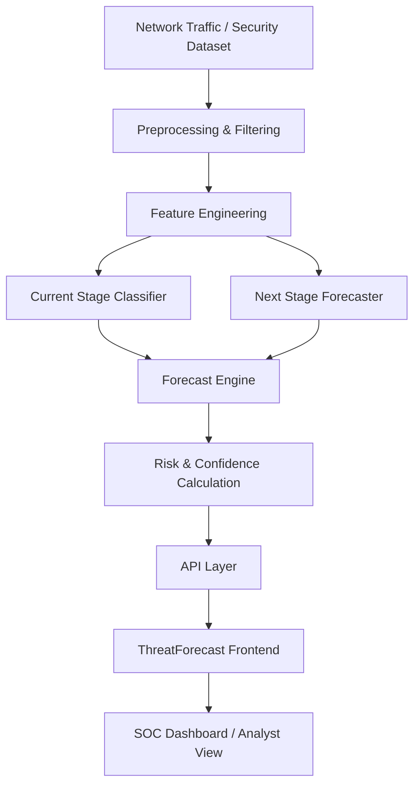

# 🛡️ ThreatForecast

### AI-Based Network Attack Forecasting & SOC Decision Support System

**Smart India Hackathon (SIH) 2026**  
**Organization:** National Technical Research Organisation (NTRO)  
**Problem Statement:** **AI based Network Attack Forecasting from Network Traffic Data**  
**Problem Statement ID:** `SIH26153`  
**Category:** Software  
**Theme:** Blockchain & Cybersecurity  

---

## 📌 Overview

**ThreatForecast** is an AI-driven cybersecurity prototype designed to forecast the **next likely stage of an ongoing cyberattack** using recent network and security telemetry.

Most traditional security tools are primarily reactive: they detect suspicious activity that is occurring now or has already occurred. ThreatForecast adds a **predictive intelligence layer** that attempts to answer:

> **What is the attacker most likely to do next?**

The system processes network/security features, analyzes recent temporal behaviour, identifies the current attack stage, predicts the likely next stage, estimates confidence and risk, and presents the result through a SOC-style dashboard.

---

## 🎯 Problem We Are Solving

Cyberattacks usually progress through multiple stages instead of happening as one isolated event.

A simplified attack path can be represented as:

```text
Benign
  ↓
Reconnaissance
  ↓
Initial Access
  ↓
Execution
  ↓
Privilege Escalation
  ↓
Lateral Movement
  ↓
Exfiltration
```

A SOC analyst may already know that suspicious activity is occurring, but the more useful question is:

> **Where is this attack heading next?**

ThreatForecast aims to give security teams **early warning** before the next stage is observed, allowing defenders to investigate, isolate affected systems, and respond sooner.

---

## 💡 Our Solution

ThreatForecast combines:

- Network traffic preprocessing
- Feature engineering
- Attack-stage classification
- Next-stage forecasting
- Risk assessment
- Explainable prediction evidence
- API integration
- Interactive frontend visualization

The goal is to transform security monitoring from:

> **Detect → Alert → Respond**

into:

> **Detect → Understand → Forecast → Prevent**

---

## ✨ Key Features

- 🔍 **Current Attack Stage Detection**
- 🔮 **Next Attack Stage Forecasting**
- 📊 **Prediction Confidence**
- 🚨 **Dynamic Risk Levels** — LOW, MEDIUM, HIGH, CRITICAL
- 🧠 **Explainable AI Evidence**
- 📈 **Attack Progression Visualization**
- 📡 **Telemetry Monitoring**
- 🖥️ **SOC-style Frontend Dashboard**
- 🔌 **API Interface between ML and Frontend**
- 🧪 **Model Training & Evaluation Pipeline**
- 🗃️ **Multi-dataset Preprocessing Support**

---

## 🧠 Attack Stages Used

| Stage | Description |
|---|---|
| **Benign** | Normal network or system activity |
| **Reconnaissance** | Scanning ports, hosts, services, or gathering network information |
| **Initial Access** | Gaining an initial foothold in the target environment |
| **Execution** | Running malicious commands, scripts, processes, or payloads |
| **Privilege Escalation** | Attempting to gain higher-level permissions |
| **Lateral Movement** | Moving from one compromised host to other internal systems |
| **Exfiltration** | Transferring sensitive information outside the network |

---

## 🏗️ System Architecture



### Simplified Flow

```text
Raw Network Data
      ↓
Preprocessing
      ↓
Feature Engineering
      ↓
Current Stage Detection
      ↓
Next Stage Forecasting
      ↓
Risk + Confidence + Evidence
      ↓
API
      ↓
Frontend SOC Dashboard
```

---

## ⚙️ How ThreatForecast Works

### 1. Dataset Preprocessing

Raw cybersecurity datasets may contain missing values, infinite values, duplicate records, different column names, different label formats, and unnecessary fields. The preprocessing layer cleans and filters the data before model training.

### 2. Feature Engineering

The model uses network/security behaviour such as:

- Failed and successful logins
- Ports scanned
- Hosts contacted
- Bytes sent and received
- Connection behaviour
- DNS activity
- SMB / RDP activity
- Process activity
- Alert severity
- External traffic behaviour

Temporal features can also be created from recent observations using values such as **mean, maximum, trend, and recent activity windows**.

### 3. Current Stage Classification

A **Random Forest** based classifier identifies the current attack stage from processed telemetry.

### 4. Next Stage Forecasting

A **Gradient Boosting** based forecaster analyzes recent temporal behaviour and estimates the most likely next attack stage.

### 5. Risk Assessment

The system assigns an analyst-friendly risk level:

```text
LOW → MEDIUM → HIGH → CRITICAL
```

### 6. Explainable Prediction

ThreatForecast is designed to show **why** a prediction was made.

```text
Current Stage:
Execution

Predicted Next Stage:
Privilege Escalation

Confidence:
87%

Risk:
HIGH

Evidence:
• Suspicious process activity increased
• Alert severity increased
• Authentication behaviour deviated from normal
```

---

## 🤖 Machine Learning Models

| Task | Model |
|---|---|
| Current Attack Stage Classification | Random Forest |
| Next Attack Stage Forecasting | Gradient Boosting |

Tree-based models were selected for the prototype because they work well with structured network-flow features, train quickly, require relatively low computational resources, and are easier to interpret than large deep-learning models.

---

## 📚 Datasets

ThreatForecast is being developed with multiple cybersecurity datasets:

- **CIC-IDS2017**
- **CSE-CIC-IDS2018**
- **UNSW-NB15**
- **CICIoT2023**
- **CTU-13**

### Why Multiple Datasets?

Using multiple datasets helps evaluate:

- Generalization
- Different attack categories
- Enterprise network behaviour
- IoT attacks
- Botnet / C2 activity
- Robustness across different traffic distributions

### ⚠️ Dataset Files Are Not Included in This Repository

The original datasets are very large, with some files exceeding **1 GB**, so they are intentionally excluded from GitHub.

Expected local structure:

```text
data/
├── raw/
│   ├── CICIDS2017/
│   ├── CICIDS2018/
│   ├── CICIoT2023/
│   ├── UNSW-NB15/
│   └── CTU13/
│
└── processed/
```

The repository's `.gitignore` prevents large raw and processed dataset files from being committed accidentally.

---

## 🧪 Evaluation

ThreatForecast should be evaluated using more than raw accuracy.

Important metrics include:

- Accuracy
- Precision
- Recall
- Macro-F1
- False Positive Rate
- Confusion Matrix
- Prediction Confidence
- Confidence Calibration
- Next-stage Forecast Accuracy

For sequential attack data, train/test separation should be performed carefully so events from the same attack campaign do not leak between training and testing.

---

## 🖥️ Frontend / SOC Dashboard

The frontend is designed as a SOC-style analyst interface and includes views for:

- Dashboard overview
- Threat monitoring
- Threat details
- Attack forecasting
- Current threat stage
- Predicted next stage
- Risk level
- Forecast confidence
- Threat distribution
- Recent alerts
- Attack progression

The frontend is built using **React + Vite**.

---

## 🔌 Backend / API Layer

The backend acts as the bridge between:

```text
Frontend
   ↕
API / Backend
   ↕
Forecast Engine
   ↕
ML Models
```

Responsibilities include:

- Receiving frontend requests
- Calling forecasting/model services
- Returning structured prediction results
- Providing telemetry/threat data to the dashboard
- Keeping ML logic separate from presentation logic

---

## 📂 Project Structure

```text
ThreatForecast/
│
├── backend/
│   ├── app.py
│   ├── routes.py
│   ├── schemas.py
│   └── services.py
│
├── dashboard/
│   └── dashboard.py
│
├── data/
│   ├── raw/                 # ignored by Git
│   └── processed/           # ignored by Git
│
├── frontend/
│   ├── public/
│   ├── src/
│   │   ├── assets/
│   │   ├── components/
│   │   ├── pages/
│   │   ├── services/
│   │   ├── App.jsx
│   │   ├── App.css
│   │   ├── index.css
│   │   └── main.jsx
│   ├── package.json
│   ├── package-lock.json
│   └── vite.config.js
│
├── ml/
│   ├── models/
│   │   ├── forecaster.joblib
│   │   └── stage_classifier.joblib
│   ├── Feature_engineering.py
│   ├── Forecast_engine.py
│   ├── progression_model.py
│   ├── real_sequence_builder.py
│   ├── sequence_builder.py
│   ├── train_forecaster.py
│   └── train_model.py
│
├── preprocessing/
│   ├── ciciot23.py
│   └── ctu.py
│
├── .gitignore
├── LICENSE
└── README.md
```

---

## 🛠️ Technology Stack

### Frontend
- React
- Vite
- JavaScript
- CSS

### Backend
- Python
- REST-style API interface

### Machine Learning
- Python
- Scikit-learn
- Random Forest
- Gradient Boosting
- Joblib

### Data Processing
- Pandas
- NumPy
- CSV / Parquet processing

### Cybersecurity
- Network Traffic Analysis
- Attack Progression Analysis
- SOC Monitoring
- Predictive Threat Intelligence
- Explainable AI

---

## 🚀 Setup & Installation

### 1. Clone the Repository

```bash
git clone https://github.com/NeehalMohanty/ThreatForecast.git
cd ThreatForecast
```

### 2. Create Python Virtual Environment

#### Windows

```powershell
python -m venv .venv
.venv\Scripts\activate
```

#### Linux / macOS

```bash
python3 -m venv .venv
source .venv/bin/activate
```

### 3. Install Python Dependencies

```bash
pip install pandas numpy scikit-learn joblib
```

Add backend-specific dependencies according to the final API implementation.

### 4. Install Frontend Dependencies

```bash
cd frontend
npm install
```

---

## ▶️ Running the Frontend

```bash
cd frontend
npm run dev
```

Vite will provide a local development URL such as:

```text
http://localhost:5173/
```

---

## ▶️ Running the Backend

From the project root:

```bash
python backend/app.py
```

Use the configured backend server command if the API is served through an ASGI server.

---

## 🧠 Model Files

The repository includes trained model files:

```text
ml/models/
├── forecaster.joblib
└── stage_classifier.joblib
```

Large training datasets are excluded, while saved models allow the prototype to demonstrate forecasting without committing multi-gigabyte files.

---

## 🎬 SIH Demo Flow

```text
1. Open ThreatForecast Dashboard
              ↓
2. Load / replay network threat activity
              ↓
3. Current attack stage is detected
              ↓
4. ThreatForecast predicts the next stage
              ↓
5. Confidence and risk are displayed
              ↓
6. Evidence supporting the prediction is shown
              ↓
7. SOC analyst receives an early warning
```

### Key Demonstration Message

> ThreatForecast is not only trying to identify what the attacker is doing now — it is trying to forecast what the attacker is likely to do next.

---

## 🔮 Future Enhancements

- MITRE ATT&CK tactic and technique mapping
- SHAP-based Explainable AI
- Top-K next-stage probabilities
- Multi-stage attack-path forecasting
- Forecast lead-time measurement
- Cross-dataset generalization evaluation
- Real-time packet / flow ingestion
- Zeek integration
- Suricata integration
- SIEM integration
- SOAR response recommendations
- Automated containment suggestions
- LSTM / Transformer sequence forecasting
- Real-time streaming inference

---

## 👥 Team & Contributions

| Team Member | Registration No. | Role | Contribution |
|---|---:|---|---|
| **Neehal Mohanty** | `2024010510` | **Team Lead — Frontend Development & Integration** | Led the team and developed the complete frontend/SOC dashboard, including UI/UX, dashboard structure, threat monitoring views, attack progression visualization, telemetry presentation, and integration of API/model outputs into the frontend. |
| **Harsh Jain** | `2024018807` | **AI Model Development & Training** | Worked on building, training, testing, and improving the machine-learning models for attack-stage classification and next-stage forecasting. |
| **Pranith Thakur** | `2024018674` | **API Interface & Integration** | Worked on the interface/API layer connecting the forecasting logic, backend services, and frontend. |
| **Lakshya Singh** | `2024025582` | **Dataset Preprocessing & Filtering** | Worked on cleaning, filtering, transforming, and preparing cybersecurity datasets for feature engineering and model training. |
| **Dimpul Pasumarthy** | `2024008609` | **Frontend Architecture** | Contributed to frontend architecture, layout planning, component organization, and dashboard structure. |
| **Shubham Hakam** | `2024204301` | **Algorithms** | Worked on algorithmic logic supporting attack analysis, attack progression, and system decision-making. |

### Team Lead Contribution

**Neehal Mohanty** coordinated the overall project while taking primary responsibility for the complete frontend implementation and integration.

Responsibilities included:

- Frontend UI/UX
- React dashboard development
- Page and component structure
- SOC-style visual presentation
- Threat monitoring interface
- Forecast visualization
- Risk/confidence presentation
- Frontend-to-API integration
- Overall team coordination

---

## ⚠️ Prototype Scope

ThreatForecast is currently a **research and SIH hackathon prototype**.

It demonstrates the feasibility of AI-assisted attack progression forecasting and SOC decision support.

A production deployment would require additional real-world validation, security hardening, continuous model monitoring, live network integration, and operational testing.

---

## 🏆 SIH Vision

ThreatForecast aims to shift cybersecurity from purely reactive monitoring toward **predictive defence**.

> **Detect → Understand → Forecast → Prevent**

## Give defenders something extremely valuable during a cyberattack — **time**.

---

## 📄 License

This repository uses the **MIT License**. See the `LICENSE` file for details.
